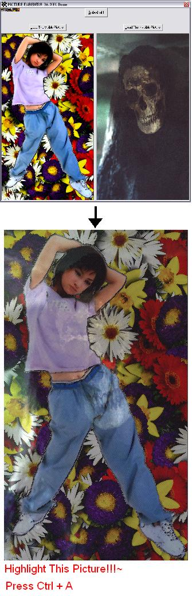



## Combine 2 pictures and make one only visible when highlighted

### Description

Combine 2 pictures and make one only visible when highlighted..See screen shot to understand what i am saying...
 
### More Info
 

             |
---                |---
**Submitted On**   |2003-10-05 02:18:44
**By**             |[ISIEO](https://github.com/Planet-Source-Code/PSCIndex/blob/master/ByAuthor/isieo.md)
**Level**          |Intermediate
**User Rating**    |4.8 (19 globes from 4 users)
**Compatibility**  |VB 5\.0, VB 6\.0
**Category**       |[Graphics](https://github.com/Planet-Source-Code/PSCIndex/blob/master/ByCategory/graphics__1-46.md)
**World**          |[Visual Basic](https://github.com/Planet-Source-Code/PSCIndex/blob/master/ByWorld/visual-basic.md)
**Archive File**   |[Combine\_2\_1653961052003\.zip](https://github.com/Planet-Source-Code/isieo-combine-2-pictures-and-make-one-only-visible-when-highlighted__1-49007/archive/master.zip)

